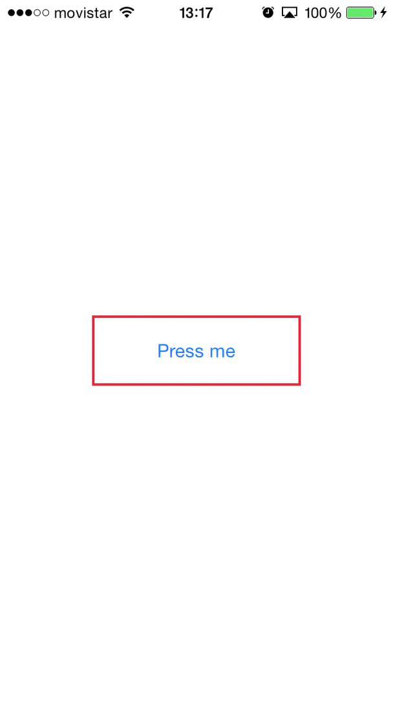

#JMButtonLoader 

JMButtonLoader is an UI Element. It's a Button that when is pressed, show an animation while action is loading.

<p align="center">
	
</p>


## Installation

#### Manual

Drag and copy [__JMButtonLoader__](JMButtonLoader.swift) file into your project

#### Carthage

```
Coming soon
```

#### CocoaPods

``` 
Coming soon
```
##Usage 
####Without UIStoryboard

1. Define `JMButtonLoader `:

   `var buttonLoader : JMButtonLoader!`

2. Create button from constructor:

    `init(frame: CGRect)`
        
3. Just need `addSubview`:

	`view.addSubview(buttonLoader)`


####With UIStoryboard

1. Add UIButton in `ViewController` or Subclass or `UIView`.

2. Change class in `Identity Inspector`:

    UIbutton -->  `JMButtonLoader`
        
3. Just need add `@IBOutlet weak var buttonLoader: JMButtonLoader!` in `ViewController` or `UIView` Storyboard class.


##Atributtes
- @IBInspectable var lineColor : UIColor = UIColor.clearColor()
- @IBInspectable var startWithBorder : Bool = false --> `This attribute is for init button with border or without this.`
- @IBInspectable var borderWidth : CGFloat = 1
- @IBInspectable var textLoading : String = "Loading..."

##Delegate
- `buttonLoader.delegate = self`
- `func buttonTapped()` is called when Button is pressed. When is pressed the button start the animation and change the text. 
- For pause the animation and stop the button, call `buttonLoader.stopButton()` and execute your callback action.

## License

JMButtonLoader is available under the MIT license.